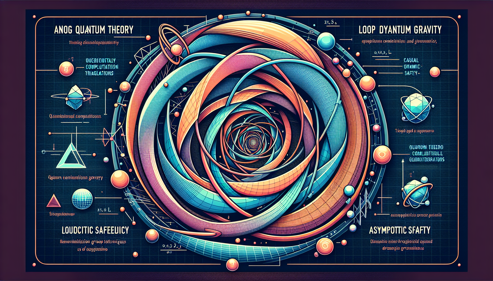

# AGENTIC AI Project

This project implements a simple chatbot using OpenAI's API. The bot is capable of answering questions by searching Wikipedia, performing calculations, and more.


examle of the resulting schematics:


example result, explaining quantum gravity theories:


next_prompt wikipedia performed, resulting in Observation: competing <span class="searchmatch">theories</span> which have been proposed. Thought experiment approaches have been suggested as a testing tool for <span class="searchmatch">quantum</span> <span class="searchmatch">gravity</span> <span class="searchmatch">theories</span>. In the field, next_prompt: what are the most important quantum gravity theories, rank them and explain why and explain their approach, plotschematics images to explain better


next_prompt search_internet performed, resulting in Observation: The quest for a comprehensive theory of quantum gravity (QG) remains a central challenge in modern theoretical physics, as current understanding is limited despite significant advancements. QG aims to describe gravity through quantum mechanics in contexts where both gravitational and quantum effects are significant, such as near black holes and during the universe's early phases. The field emerged from the need to unify quantum mechanics and general relativity, leading to developments in various mathematical frameworks and competing theories, primarily string theory and loop quantum gravity.

Notably, a new approach proposed by Jonathan Oppenheim suggests retaining gravity as a classical theory while coupling it to quantum theory via a probabilistic mechanism. Recent papers from University College London announce a radical unification of gravity and quantum mechanics that aligns with Einstein’s classical spacetime concept. The urgency for a quantum theory that can extend beyond general relativity is heightened by recent breakthroughs in gravitational observation.

The historical complexity of quantum gravity theories, including insights from quantum information theory and efforts from the mid-1980s using string theory, continues to shape the discourse. Some quantum gravity theories suggest that high-energy photons may interact with the vacuum as if it were a medium, prompting investigations such as those conducted by the Large High Altitude Air Shower Observatory in China that examine Lorentz invariance in gamma-ray bursts, with no observed violations thus far., next_prompt: wikipedia performed, resulting in Observation: competing <span class="searchmatch">theories</span> which have been proposed. Thought experiment approaches have been suggested as a testing tool for <span class="searchmatch">quantum</span> <span class="searchmatch">gravity</span> <span class="searchmatch">theories</span>. In the field, next_prompt: what are the most important quantum gravity theories, rank them and explain why and explain their approach, plotschematics images to explain better


next_prompt generate_schematic_image performed, resulting in Observation:  schematics plotted and saved to result_image/schematic_image.png, next_prompt: search_internet performed, resulting in Observation: The quest for a comprehensive theory of quantum gravity (QG) remains a central challenge in modern theoretical physics, as current understanding is limited despite significant advancements. QG aims to describe gravity through quantum mechanics in contexts where both gravitational and quantum effects are significant, such as near black holes and during the universe's early phases. The field emerged from the need to unify quantum mechanics and general relativity, leading to developments in various mathematical frameworks and competing theories, primarily string theory and loop quantum gravity.

Notably, a new approach proposed by Jonathan Oppenheim suggests retaining gravity as a classical theory while coupling it to quantum theory via a probabilistic mechanism. Recent papers from University College London announce a radical unification of gravity and quantum mechanics that aligns with Einstein’s classical spacetime concept. The urgency for a quantum theory that can extend beyond general relativity is heightened by recent breakthroughs in gravitational observation.

The historical complexity of quantum gravity theories, including insights from quantum information theory and efforts from the mid-1980s using string theory, continues to shape the discourse. Some quantum gravity theories suggest that high-energy photons may interact with the vacuum as if it were a medium, prompting investigations such as those conducted by the Large High Altitude Air Shower Observatory in China that examine Lorentz invariance in gamma-ray bursts, with no observed violations thus far., next_prompt: wikipedia performed, resulting in Observation: competing <span class="searchmatch">theories</span> which have been proposed. Thought experiment approaches have been suggested as a testing tool for <span class="searchmatch">quantum</span> <span class="searchmatch">gravity</span> <span class="searchmatch">theories</span>. In the field, next_prompt: what are the most important quantum gravity theories, rank them and explain why and explain their approach, plotschematics images to explain better


next_prompt generate_schematic_image performed, resulting in Observation:  schematics plotted and saved to result_image/schematic_image.png, next_prompt: generate_schematic_image performed, resulting in Observation:  schematics plotted and saved to result_image/schematic_image.png, next_prompt: search_internet performed, resulting in Observation: The quest for a comprehensive theory of quantum gravity (QG) remains a central challenge in modern theoretical physics, as current understanding is limited despite significant advancements. QG aims to describe gravity through quantum mechanics in contexts where both gravitational and quantum effects are significant, such as near black holes and during the universe's early phases. The field emerged from the need to unify quantum mechanics and general relativity, leading to developments in various mathematical frameworks and competing theories, primarily string theory and loop quantum gravity.

Notably, a new approach proposed by Jonathan Oppenheim suggests retaining gravity as a classical theory while coupling it to quantum theory via a probabilistic mechanism. Recent papers from University College London announce a radical unification of gravity and quantum mechanics that aligns with Einstein’s classical spacetime concept. The urgency for a quantum theory that can extend beyond general relativity is heightened by recent breakthroughs in gravitational observation.

The historical complexity of quantum gravity theories, including insights from quantum information theory and efforts from the mid-1980s using string theory, continues to shape the discourse. Some quantum gravity theories suggest that high-energy photons may interact with the vacuum as if it were a medium, prompting investigations such as those conducted by the Large High Altitude Air Shower Observatory in China that examine Lorentz invariance in gamma-ray bursts, with no observed violations thus far., next_prompt: wikipedia performed, resulting in Observation: competing <span class="searchmatch">theories</span> which have been proposed. Thought experiment approaches have been suggested as a testing tool for <s


## Installation

1. Clone the repository.
2. Install the dependencies:

    ```
    pip install -r requirements.txt
    ```

3. Set up your environment variable for the OpenAI API key:

    ```
    export OPENAI_API_KEY='your-api-key-here'
    ```

## Usage

To start the chatbot, run the `main.py` file:

