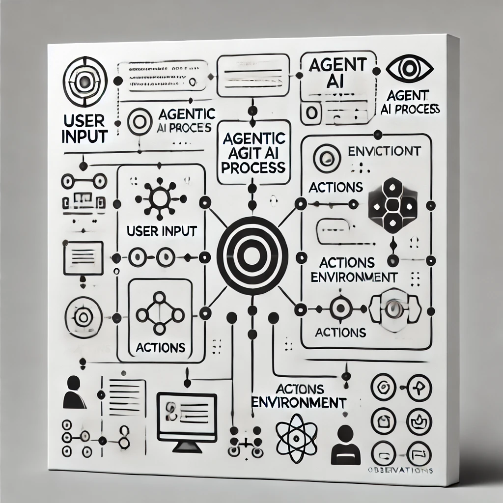

# AGENTIC AI Project

This project implements an advanced Agent AI system using OpenAI's API. The AI is capable of handling various queries by leveraging different actions such as searching the internet, performing calculations, generating plots, and more. The project also features logging capabilities to record queries, actions, and results for debugging and analysis.

## Workflow Overview

The AGENTIC AI system processes user queries through a structured and well-defined workflow, ensuring accurate and contextually relevant responses. Below is a simplified explanation of how the system operates:

1. **Start**: The process begins when the user inputs a query. This could be a question or a request for information.
   
2. **Agentic AI Process**: The central AI process interprets the query and decides which action to take based on the query's context. The AI is equipped with the ability to make decisions autonomously, selecting the most appropriate action to fulfill the user's request.

3. **Known Actions**: The AI can perform several predefined actions, including:
   - **Search Internet**: Fetches relevant information from the web and ranks it based on relevance.
   - **Plot Line**: Creates visual plots based on the data provided and saves the result as an image.
   - **Generate Schematic**: Uses AI tools to create schematic images based on a detailed description.
   - **Ask User**: Seeks clarification from the user if the input query is ambiguous or requires further details.

4. **Logging**: Every action, query, and result is logged for reference and debugging purposes. This helps in tracking the AI's decision-making process and understanding the outcomes.

5. **Final Response**: After performing the necessary actions, the AI compiles all relevant information and provides a final, refined response to the user.

This flow ensures that the AI effectively uses available tools to generate the most accurate and relevant responses while maintaining a clear and organized process that is easy to follow.

### Example Schematic

### Example Result: Explaining Quantum Gravity Theories

